import Tabs from '@theme/Tabs';
import TabItem from '@theme/TabItem';

# Outlines

## Overview

Once the raw points are available, we often want to turn them into solid, continuous outlines.
We do this by selecting an arbitrary subset of points and placing shapes there to form a part, and then use boolean operations (i.e., addition, subtraction, or intersection) to combine parts into a final outline to export.

The points on their own are just centers with a rotation, but with a little binding they can grow into a single, contiguous plate:

<Tabs>
<TabItem value="points" label="Points" default>
<div style={{textAlign: 'center'}}>

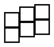

</div>
</TabItem>
<TabItem value="outline" label="Outline">
<div style={{textAlign: 'center'}}>

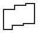

</div>
</TabItem>
</Tabs>

We'll get back to how an individual part looks soon &ndash; but first, we need to get familiar with binding and filtering.

<br />

## Binding

While the points are enough to place properly positioned and rotated shapes (most commonly, rectangles, representing the keys of the board), these usually won't combine into a contiguous shape since there won't be any overlap.
So the first part of outline generation is thinking about "binding", where we can make the individual switch holes reach out towards (or, _bind_ to) each other.
Think of this as a kind of "neighbor declaration", telling Ergogen which directions to grow towards (and by how much) to reach the next-door point.

Of course, overlap could be achieved by placing larger shapes at each of the points, causing them to overlap by default, but since everything is placed by its center point, these larger shapes would result in larger outside margins as well.
With bind, we can declare the selective directions in which to grow the shapes placed, so that their final combination can become contiguous, yet with as little (or as much) margin as we might want.

### Explicit

The fully customizable way to add binding to points is through the key-level attribute `bind`:

```yaml
bind: num | [num_x, num_y] | [num_t, num_r, num_b, num_l] # defer to autobind by default
```

To recap, key-level declaration means that `bind` should be specified in the `points` section, benefiting from the same extension process every key-level attribute does.
Valid values follow CSS standards, so `num` applies to all directions, `num_x` horizontally, `num_y` vertically, and the `t`/`r`/`b`/`l` versions to top/right/bottom/left, respectively.

:::tip
Don't recall seeing `bind` in the [Keys](./points.md#keys) section, where supposedly all key-level attributes were listed?
That's because those were only the ones with meaning to the layout system.
Apart from those, *anything* can be declared as a key-level attribute, and some might gain meaning in later stages, like `bind` did just now.
:::

### Automatic

To spare us the `bind` declaration whenever possible, Ergogen offers an `autobind` key-level attribute as well.
Its value is a single number (`10` by default), and the relevant directions are calculated automatically (by looking at intra- and inter-column bounding boxes).
Basically, if we want bound shapes, we only need to say so (by setting `bound: true`, see [below](#common-attributes)) in most cases &ndash; or specify a larger `autobind` value once if `10` wasn't enough to bridge the gaps.
And if autobinding fails for a more complex shape, we can always fall back to explicit `bind` declarations.

### Examples

<details>
<summary>Explicit bind</summary>

Here each `15` mm key rectangle gets an explicit `bind: 4`, so the shapes grow just enough to touch their neighbours and fuse into one contiguous plate (note the `bound: true` on the part, which actually activates the binding).
Because we only grow by the amount we need, the final margin stays tight &ndash; much smaller than we'd get by simply placing oversized tiles.

<Tabs>
<TabItem value="config" label="Config" default>

```yaml
points:
  zones:
    matrix:
      columns:
        a:
        b:
        c:
      rows:
        home:
        top:
      key:
        bind: 4
outlines:
  plate:
    - what: rectangle
      where: true
      size: 15
      bound: true
```

</TabItem>
<TabItem value="visualization" label="Visualization">
<div style={{textAlign: 'center'}}>

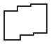

</div>
</TabItem>
</Tabs>

</details>

<details>
<summary>Autobind</summary>

The exact same layout, but without any `bind` declaration at all.
With `bound: true`, Ergogen falls back to `autobind` (default `10`), figures out the neighbouring directions on its own, and still produces a contiguous plate &ndash; no manual binding required.

<Tabs>
<TabItem value="config" label="Config" default>

```yaml
points:
  zones:
    matrix:
      columns:
        a:
        b:
        c:
      rows:
        home:
        top:
outlines:
  plate:
    - what: rectangle
      where: true
      size: 15
      bound: true
```

</TabItem>
<TabItem value="visualization" label="Visualization">
<div style={{textAlign: 'center'}}>


</div>
</TabItem>
</Tabs>

</details>

<br />

## Filtering

Filtering is how Ergogen decides which points to use when placing the shape we're currently placing.
After all, the points section might contain lots of zones, multiple *kinds* of points, helpers for mounting holes or one-off PCB footprints, etc.
So being able to easily select a subset of these points can come in handy.

### Basics

First up, let's see what a filter means depending on what datatype we use when declaring it:

- **`undefined`**: if left empty, a filter produces the default `[0, 0, 0°]` origin point.

- **boolean**: if the filter is `true`, all points are used; if it's `false`, no points are used.

- **string**: represents a single/simple filter &ndash; the workings of which we'll discuss in a second.

- **object**, or **array that contains an object** somewhere: will be parsed as an [anchor](./points.md#anchors), returning the single resulting point.

  :::note
  Although there can be valid anchor declarations that are neither objects, nor arrays containing an object at any depth, these are not supported where filters are expected because Ergogen would have no way to decide what it's looking at.
  Remember, however, that every anchor **can** be represented in full object form &ndash; any other representation is just a shorthand for convenience.
  :::

- **array containing no objects** at any depth: complex filter, see [Advanced usage](#advanced-usage).

So the undefined and boolean cases are easy, objects just redirect to anchors, and arrays are more advanced.
What about strings, then?

At their simplest, strings just compare the given value against the name of each key and check for straight equality.
Since names are unique, this makes it easy to single out a point, but nothing more. How do we get "real" subsets?

Enter the `tags` key-level attribute.
It can be either an array (containing string tags, or "labels" that should apply to the given point), or an object (in which case the keys from its key/value pairs count).
Arrays are probably more readable, while objects might be more easily extendable via inheritance or preprocessing.
Use whichever form makes sense.

:::tip
`tags` is yet another key-level attribute that gains meaning during outlining only, like `bind` did above.
:::

By default, string filters consider not only the name of each key but their tags, too.
And combining their basic exact matching behavior with a non-unique field leads to easy subset selection. Yay!

But wait, there's more!
If the string is surrounded by `/`s (slashes), it's interpreted as a regex, and exact matching changes to pattern matching.
So we might not even *need* tags for, say, differentiating zones because we know that key names by default are formatted as `zone_column_row` so we can just say something like `/^matrix_.*/` to filter any key whose name starts with the substring `matrix_`.
The usual regex flags are also supported if specified after the trailing slash, so feel free to use case-insensitive, multiline, or even unicode expressions should the need arise.

Finally, if it would be easier to select what we **don't** want instead of what we **do** want, filters support negation if prefixed by a `-` (minus).
So while saying `matrix_pinky_home` select only that one key, `-matrix_pinky_home` selects everything *except* that key.
This also works with both tags and regexes, of course, so `-alpha` selects everything that isn't tagged with `alpha` (assuming the existence of an alpha tag), and `-/pinky/` selects keys where the "pinky" substring *isn't* found anywhere within the name or any of its tags.

### Advanced usage

Every single filter actually consists of three components:

1. **which** key-level attributes to check against,
2. **how** to check against them, and
3. **what** value to check against them.

So far, we've only used the third component, as the **which** part was always the default `name` and `tags`, while the **how** part was interpreted as the special "similarity" operator, handling both exact matches and regexes.
But what if we want to check against some other key-level attribute; or check in a different way?

Enter full form filters.
In the background, writing `something` gets translated as `meta.name,meta.tags ~ something`, where `meta` is each key's metadata containing all key-level attributes (see [Keys](./points.md#keys)) and `~` is the similarity operator.
So if we want to check against something else (say, we declared our own `foobar` field among the other key-level attributes), then we can simply say `meta.foobar ~ something`.
As for operators, only similarity (`~`) is implemented for now, but others (such as mathematical relations) will be added in the future.

For even more advanced usage, we can combine simple filters with AND/OR logical relations into complex filters using arrays.
Odd levels of array nesting represent OR, while even levels represent AND.
So, for example, writing `[something, other]` would mean that all points are returned where either `something` **OR** `other` matches the name/tags, while `[[something, other]]` would only return points where both `something` **AND** `other` matches (note the double arrays in the latter case).

### Examples

The examples below all share this small layout: a `matrix` zone (whose keys are tagged `alpha`) and a two-key `thumb` zone (tagged `thumb`). Each example simply places a `15` mm rectangle at whichever points its `where` filter selects, so the resulting outline *is* the selected subset.

```yaml
points:
  zones:
    matrix:
      columns:
        pinky:
        ring:
        middle:
      rows:
        home:
        top:
      key:
        tags: [alpha]
    thumb:
      anchor:
        ref: matrix_pinky_home
        shift: [0, -20]
      columns:
        inner:
        outer:
      key:
        tags: [thumb]
```

<details>
<summary>Tags</summary>

`where: thumb` matches every key carrying the `thumb` tag &ndash; here, the two thumb keys.

<Tabs>
<TabItem value="config" label="Config" default>

```yaml
outlines:
  selection:
    - what: rectangle
      where: thumb
      size: 15
```

</TabItem>
<TabItem value="visualization" label="Visualization">
<div style={{textAlign: 'center'}}>

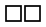

</div>
</TabItem>
</Tabs>

</details>

<details>
<summary>Regexes</summary>

`where: /^matrix_pinky/` matches every key whose name starts with `matrix_pinky` &ndash; i.e. the whole pinky column.

<Tabs>
<TabItem value="config" label="Config" default>

```yaml
outlines:
  selection:
    - what: rectangle
      where: /^matrix_pinky/
      size: 15
```

</TabItem>
<TabItem value="visualization" label="Visualization">
<div style={{textAlign: 'center'}}>


</div>
</TabItem>
</Tabs>

</details>

<details>
<summary>Negation</summary>

Prefixing with `-` inverts the match: `where: -thumb` selects everything *except* the `thumb`-tagged keys, i.e. the whole matrix.

<Tabs>
<TabItem value="config" label="Config" default>

```yaml
outlines:
  selection:
    - what: rectangle
      where: -thumb
      size: 15
```

</TabItem>
<TabItem value="visualization" label="Visualization">
<div style={{textAlign: 'center'}}>

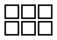

</div>
</TabItem>
</Tabs>

</details>

<details>
<summary>Full filters</summary>

Here the layout is tweaked so each key carries a custom `home_row` key-level attribute (set per row). The full-form filter `meta.home_row ~ true` checks against *that* attribute instead of the default name/tags, selecting just the home row.

<Tabs>
<TabItem value="config" label="Config" default>

```yaml
points:
  zones:
    matrix:
      columns:
        pinky:
        ring:
        middle:
      rows:
        home:
          home_row: true
        top:
          home_row: false
outlines:
  selection:
    - what: rectangle
      where: meta.home_row ~ true
      size: 15
```

</TabItem>
<TabItem value="visualization" label="Visualization">
<div style={{textAlign: 'center'}}>


</div>
</TabItem>
</Tabs>

</details>

<details>
<summary>Combination</summary>

Nesting arrays combines simple filters. The double-nested `[[alpha, /_top$/]]` is an **AND**: it selects keys that are *both* tagged `alpha` *and* whose name ends in `_top` &ndash; the matrix top row only (thumbs are excluded, since they aren't `alpha`).
A single-nested `[alpha, thumb]` would instead be an **OR**.

<Tabs>
<TabItem value="config" label="Config" default>

```yaml
outlines:
  selection:
    - what: rectangle
      where: [[alpha, /_top$/]]
      size: 15
```

</TabItem>
<TabItem value="visualization" label="Visualization">
<div style={{textAlign: 'center'}}>


</div>
</TabItem>
</Tabs>

</details>

<br />

## Parts

With this, we can finally move on to the outlines themselves.
The relevant section in the config will look something like this:

<Tabs>
<TabItem value="array" label="Array notation" default>

```yaml
outlines:
  <outline_name>:
    - <part>
    - <part>
    - ...
  ...
```

</TabItem>
<TabItem value="object" label="Object notation">

```yaml
outlines:
  <outline_name>:
    part1: <part>
    part2: <part>
    ...
  ...
```

</TabItem>
</Tabs>

:::note
Listing parts within an outline can be an object as well as an array (see "Object notation" tab).
Objects might be beneficial if part names are important for config readability (or when YAML or built-in inheritance is used), while arrays are a bit more terse.
Use whichever form makes more sense.
:::

Operations are performed in order, and the resulting shape is exported as an output.
Additionally, it is going to be available for further outline declarations to use (through the `outline` type, see below) under the name specified (`<outline_name>`, in this case).

Now let's see how those `<part>`s are made.

### Common attributes

Each part has the following common attributes:

- **`what`**: declares *what* shape we want to place &ndash; see [Shapes](#shapes).

- **`where`**: declares *where* we want to place those shapes &ndash; this is where we can use the previously discussed filters.

- **`operation`**: indicates how we want the current part to combine with the cumulative result of previous parts.
Options include:

  - **`add`**: produces an union &ndash; this is the default operation.
  - **`subtract`**: subtracts this part from the in-progress result.
  - **`intersect`**: computes the intersection of this part and the in-progress result.
  - **`stack`**: just draws the current part "on top of" the in-progress result (possibly crossing lines instead of calculating unions).

    :::tip
    `stack` can be used as a computationally "cheaper" `subtract` in some cases, but it's mostly for being able to visualize individual parts in the context of other parts and getting a sense of what happens (i.e., debugging).
    :::

- **`bound`**: boolean value, representing whether we want to activate binding on the shapes or not.
If `false`, the shapes are placed as-is.
If `true`, the corresponding binding rectangles are added to each relevant side of each shape and the results union'ed.

- **`asym`**: the field is a companion to the `where` filter and represents how filtering should treat mirrored points.
  The same values are available that we've discussed in the [Mirroring](./points.md#mirroring) section &ndash; the canonical choices are `source`/`clone`/`both`.

  - The default `source` only returns the points matched by the filter.

  - `clone` returns only the mirrored versions of the points that would be matched by the filter.

  - `both` returns both the regular matches and their mirror images.

    :::caution
    If the filter translates to an anchor, this check is ***strict*** &ndash; meaning that Ergogen will error out if the mirror image doesn't exist.
    On the other hand, the mirror check is permissive for regular filters, including them if they exist and ignoring the cases where they don't.
    :::

- **`adjust`**: a relative anchor by which to adjust the position of each shape &ndash; similarly to the key-level `adjust` attribute.

  :::tip
  This field makes it possible to place shapes not only **at** certain filtered points, but also **below** or **next to** those points.
  :::

- **`scale`**: an optional multiplier by which to scale the resulting shape.
  The default is `1` for no scaling.

- **`expand`**: a number in mm's by which to expand (or shrink, if the number is negative) the current outline.
  Differs from `scale`ing because it draws and external (or internal) "outline" for the starting shape, thereby usually changing the shape itself, too, not just its size.
  For more info, see the relevant [Maker.JS docs](https://maker.js.org/docs/advanced-drawing/#Expanding%20paths).

- **`joints`**: a companion to `expand`, specifying which type of treatment to apply to the joints during expansion/shrinking.

  - `0` or `round` means the corners will be rounded (thereby having **zero** joints);
  - `1` or `pointy` means the corners will stay (thereby still having **one** joint); and
  - `2` or `beveled` means the corners will get beveled (thereby having **two** joints).

- **`fillet`**: this number (if greater than the default zero) triggers a filleting operation on the (almost-)completed part and rounds its corners with the given radius.
  If the radius is larger than either of the corner's neighboring line segments, that corner is skipped.

  :::tip
  Once a corner is filleted, it won't be filleted again, so it's safe to apply a `fillet` with increasingly smaller radii to catch every sharp corner if desired.
  :::

### Shapes

Shapes can have their own, shape-specific attributes on top of the ones already discussed above.
Additionally, each shape can introduce shape-specific units to the evaluation context to further avoid repetition.

:::tip
Say we'd want to express that a rectangle of size `10` should be adjusted half of its width to the right.
We could write `adjust.shift: [5, 0]`, of course, but then if the size changes, the shift needs to change as well.
Instead, we could write `adjust.shift: [.5 sx, 0]`, referencing the size's x value (i.e., its width).
:::

With this, let's see a list of what actual shapes we can place, what extra attributes they have, and what extra units they introduce:

- **`rectangle`**: A basic rectangle primitive.

  - **`size`**: Either a number or an array in the form `[num_x, num_y]`, representing the width/height of the rectangle(s) to place. If it's a single number `num`, it's interpreted as `[num, num]` (i.e., a square). Mandatory. Introduces `sx` and `sy` as units for width and height, respectively.

  - **`bevel`**: Optional beveling for the rectangles, default is `0`.

  - **`corner`**: Optional corner radius for the rectangles, default is `0`.

    :::caution
    `size` represents the final size of the resulting rectangle, so any `bevel` or `corner` values are subtracted from it appropriately to make room for the bevels/radii.
    This can lead to an error if the size is too small (or the `bevel`/`corner` values are too large).
    :::

    :::tip
    Corners and bevels can be used simultaneously.
    Corner radii are applied after beveling, leading to rounded bevels.
    :::

- **`circle`**: A basic circle primitive.

  - **`radius`**: The radius of the circle to place. Mandatory. Introduces `r` as a unit.

- **`polygon`**: A custom polygon.

  - **`points`**: Mandatory array of anchors, representing the points of the polygon.
    Each item of the array is a regular anchor &ndash; the only difference is that if its `ref` is unspecified, the polygon's previous point will be assumed (to simulate a continuous chain).
    For the first point, `[0, 0, 0°]` is assumed to be the starting point by default (as the polygon will be placed using a `[0, 0]` origin anyway).

    :::note
    The shape name is `polygon` &ndash; the `poly` shorthand is *not* accepted by the `what` field.
    :::

- **`outline`**: Allows reuse of an already existing outline as a primitive for further outlines.

  - **`name`**: The name to identify the outline to place. Mandatory.

  - **`origin`**: An optional anchor to specify which point in the existing outline to consider as the origin (i.e., the location of the outline by which it's placed at the requested points during outlining).

    :::tip
    `origin` is functionally identical to the globally available `adjust`, only it applies before placing each outline at the target points while `adjust` applies afterwards.
    Both options are available for flexibility, feel free to use either (or both in conjunction, if appropriate).
    :::

- **`path`**: A free-form shape built from a sequence of connected `segments`, so it can mix straight lines with curves.

  - **`segments`**: Mandatory array of segments. Each segment is drawn starting from where the previous one ended, and once all segments are laid down Ergogen automatically closes the shape with a straight line from the last point back to the first. The segments must therefore form a single, closed loop &ndash; otherwise Ergogen errors out with *"The provided path configuration doesn't generate a closed shape."* Each segment has:

    - **`type`**: one of `line`, `arc`, `s_curve`, or `bezier`.

    - **`points`**: an array of [anchors](./points.md#anchors), exactly like `polygon`'s points (ref-less anchors chain from the previous point). How many points a segment needs depends on its `type` &ndash; and, since every segment after the first inherits its starting point from the previous segment, later segments need one point fewer:

      | `type` | first segment | later segments |
      | --- | --- | --- |
      | `line` | 2 or more | 1 or more |
      | `arc` | exactly 3 (start, mid, end) | exactly 2 (mid, end) |
      | `s_curve` | exactly 2 (start, end) | exactly 1 (end) |
      | `bezier` | 3 or 4 (start, control(s), end) | 2 or 3 |

    - **`accuracy`**: optional, and only valid on `bezier` segments &ndash; controls how finely the curve is approximated.

    :::note
    An `s_curve`'s two points must differ in *both* their X and Y coordinates, since the S is fitted into the bounding box spanning between them.
    :::

  <details>
  <summary>Worked example</summary>

  A single `path` made of a bottom line, an `arc` bulging out to the right, and a top line; the left side is drawn by the automatic closing line.

  <Tabs>
  <TabItem value="config" label="Config" default>

  ```yaml
  points.zones.point:
  outlines:
    tag:
      - what: path
        segments:
          - type: line
            points:
              - { ref: point, shift: [-10, -6] }
              - { ref: point, shift: [10, -6] }
          - type: arc
            points:
              - { ref: point, shift: [14, 0] }
              - { ref: point, shift: [10, 6] }
          - type: line
            points:
              - { ref: point, shift: [-10, 6] }
  ```

  </TabItem>
  <TabItem value="visualization" label="Visualization">
  <div style={{textAlign: 'center'}}>

  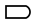

  </div>
  </TabItem>
  </Tabs>

  </details>

- **`hull`**: A [hull](https://en.wikipedia.org/wiki/Convex_hull) wrapped around a set of anchor points &ndash; great for generating an organic case outline that hugs a cluster of keys.

  - **`points`**: Mandatory array of [anchors](./points.md#anchors) to wrap. Unlike `polygon`, the order of the points doesn't matter, since the hull is computed from the set as a whole.

  - **`extend`**: Optional boolean, default `true`. When `true`, each anchor contributes its *entire* key footprint (using the key's `width`/`height`, `18` by `18` by default) rather than just its center point, so the hull wraps around the keys instead of slicing through their centers. For keys larger than `18` on a side, extra points are added along the edges so the hull can't fold inward. Set it to `false` to hull the bare center points instead.

  - **`concavity`**: Optional number, default `50`. Controls how tightly the outline follows the points: large values approach a plain convex hull, while smaller values let the outline dip inward (concave) to hug the points more closely.

  <details>
  <summary>Worked example</summary>

  A hull wrapped around a few staggered matrix keys plus a rotated thumb key. Thanks to the default `extend: true`, it hugs the outer edges of the key footprints.

  <Tabs>
  <TabItem value="config" label="Config" default>

  ```yaml
  points:
    zones:
      matrix:
        columns:
          a:
          b:
            key.stagger: 8
          c:
            key.stagger: 16
        rows:
          home:
          top:
      thumb:
        anchor:
          ref: matrix_a_home
          shift: [-4, -22]
          rotate: 20
  outlines:
    case:
      - what: hull
        points:
          - matrix_a_top
          - matrix_c_top
          - matrix_c_home
          - thumb
  ```

  </TabItem>
  <TabItem value="visualization" label="Visualization">
  <div style={{textAlign: 'center'}}>

  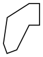

  </div>
  </TabItem>
  </Tabs>

  </details>

### Syntactic sugar

At this point, we're done with actual outline functionality, but there are some extra shorthands and conveniences worth mentioning.

The first kind are `string shorthands`, where a part within an outline is given by a single string instead of a whole object.
This is a streamlined way to refer to already existing outlines and combine them further.
The format of this string should start with a symbol from `[+, -, ~, ^]`, followed by a name, and is equivalent to adding/subtracting/intersecting/stacking an outline of that name, respectively.
More specifically, `~something` is equivalent to:

```yaml
what: outline
where: undefined # meaning [0, 0, 0°], so just placing the outline where it is
name: something
operation: intersect
```

If the symbol prefix is missing, addition is assumed &ndash; so simply naming outlines as parts works, too.

Another minor shorthand is declaring the `expand` and `joints` fields all at once using just the `expand` field, and specifying its value as the number for the expansion, followed by either `)`, `>`, or `]` (representing `round`, `pointy`, and `beveled` joints, respectively).
So an `expand` value of `3]` would translate to:

```yaml
expand: 3
joints: beveled
```

Finally, "private" outlines: if we only want to use an outline as a building block for further outlines, we can start its name with an underscore (e.g., `_my_name`) to prevent it from being actually exported.
(By convention, a starting underscore is kind of like a "private" marker.)

### Examples

<details>
<summary>Shapes</summary>

Three parts, one of each basic primitive &ndash; a `rectangle`, a `circle`, and a `polygon` (a triangle, whose ref-less points chain relative to one another) &ndash; each placed at its own point.

<Tabs>
<TabItem value="config" label="Config" default>

```yaml
points:
  zones:
    demo:
      columns:
        rect:
        circ:
        poly:
outlines:
  shapes:
    - what: rectangle
      where: demo_rect
      size: 16
    - what: circle
      where: demo_circ
      radius: 8
    - what: polygon
      where: demo_poly
      points:
        - shift: [0, 8]
        - shift: [8, -16]
        - shift: [-16, 0]
```

</TabItem>
<TabItem value="visualization" label="Visualization">
<div style={{textAlign: 'center'}}>

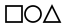

</div>
</TabItem>
</Tabs>

</details>

<details>
<summary>Boolean operations</summary>

The first part adds a bound plate over the whole matrix (the default `add` operation), and the second part uses `operation: subtract` to punch a couple of circular mounting holes out of it.

<Tabs>
<TabItem value="config" label="Config" default>

```yaml
points:
  zones:
    matrix:
      columns:
        a:
        b:
        c:
      rows:
        home:
        top:
outlines:
  plate:
    - what: rectangle
      where: true
      size: 15
      bound: true
    - what: circle
      where: [matrix_a_top, matrix_c_home]
      radius: 2.5
      operation: subtract
```

</TabItem>
<TabItem value="visualization" label="Visualization">
<div style={{textAlign: 'center'}}>

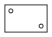

</div>
</TabItem>
</Tabs>

</details>

<details>
<summary>Asymmetry</summary>

The layout is mirrored (via `points.mirror`), so both halves get the plate. The subtracted hole, however, targets a single point &ndash; `matrix_outer_top`. With the default `asym: source` only the left half would get the hole; setting `asym: both` adds the mirror image too, so the hole appears symmetrically on both hands.

<Tabs>
<TabItem value="config" label="Config" default>

```yaml
points:
  zones:
    matrix:
      columns:
        inner:
        outer:
      rows:
        home:
        top:
  mirror: 60
outlines:
  board:
    - what: rectangle
      where: true
      size: 15
      bound: true
    - what: circle
      where: matrix_outer_top
      radius: 4
      asym: both
      operation: subtract
```

</TabItem>
<TabItem value="visualization" label="Visualization">
<div style={{textAlign: 'center'}}>

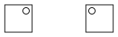

</div>
</TabItem>
</Tabs>

</details>

<details>
<summary>Adjustments</summary>

Both parts use the same `where: true` filter, but the second one carries an `adjust.shift: [0, -12]`, dropping each circle `12` mm *below* its key &ndash; showing how `adjust` places shapes relative to the filtered points rather than exactly on them.

<Tabs>
<TabItem value="config" label="Config" default>

```yaml
points:
  zones:
    matrix:
      columns:
        a:
        b:
        c:
outlines:
  labels:
    - what: rectangle
      where: true
      size: 15
    - what: circle
      where: true
      radius: 3
      adjust.shift: [0, -12]
      operation: stack
```

</TabItem>
<TabItem value="visualization" label="Visualization">
<div style={{textAlign: 'center'}}>

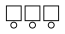

</div>
</TabItem>
</Tabs>

</details>
